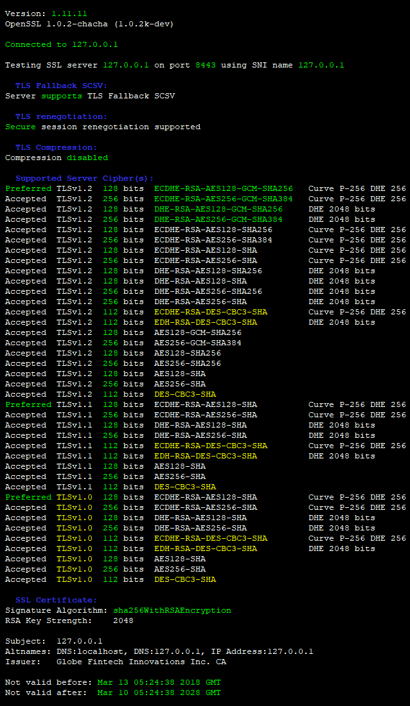

# centos-4.8-nginx-proxy
CentOS 4.8-i386 + OpenSSL 1.0.1u (TLS 1.0, 1.1 and 1.2) + cURL 7.62.0 + nginx 1.14.1 demo

**Build / Run:**
```
$ docker build -t centos:4.8 .
$ docker run -d -p 8080:8080 -p 8443:8443 --name centos-4.8 --rm centos:4.8
```

Now, visit [http://127.0.0.1:8080](http://127.0.0.1:8080) or [https://127.0.0.1:8443](https://127.0.0.1:8443)

```
$ sslscan 127.0.0.1:8443
```
